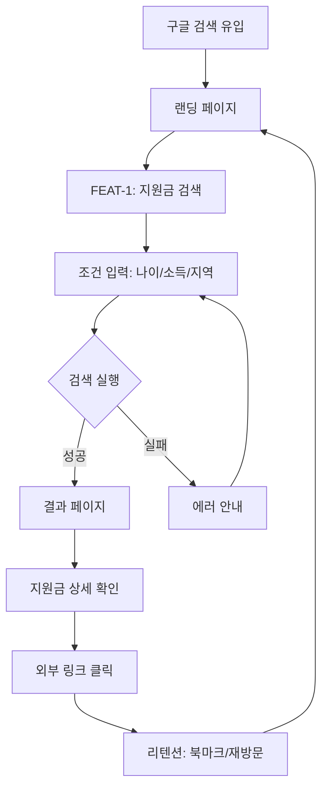
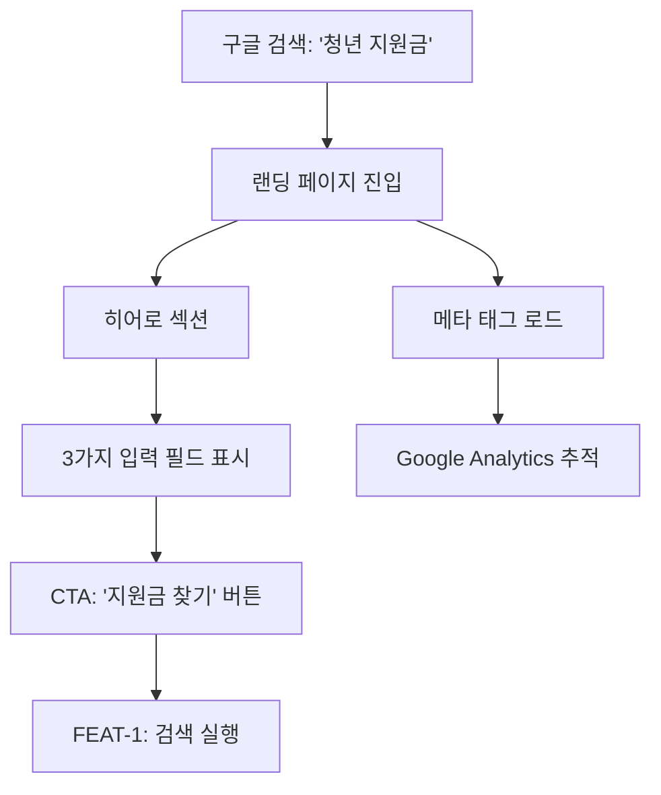
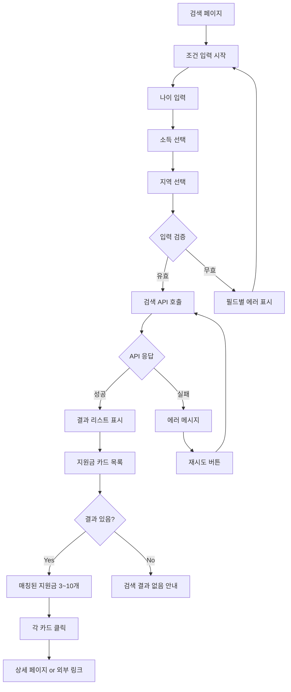
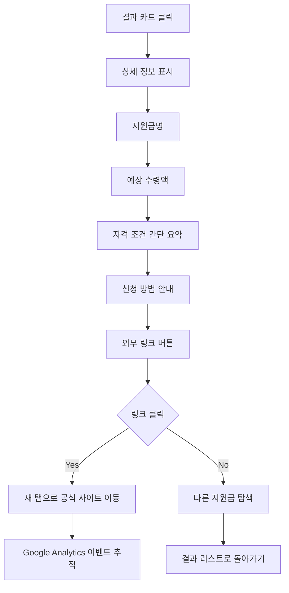
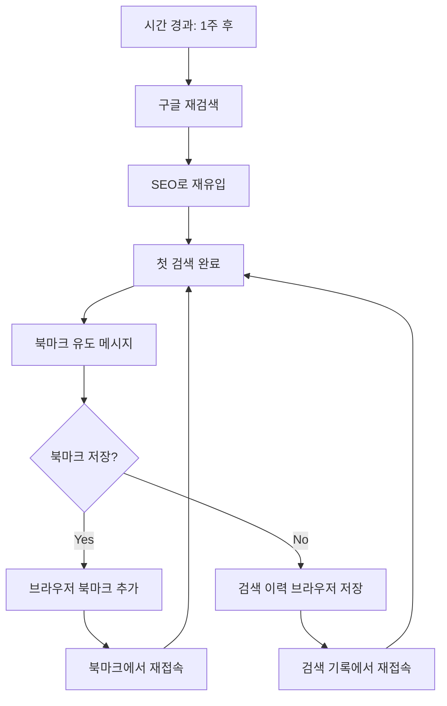

# User Flow (사용자 흐름도)

> Mermaid 플로우차트로 핵심 기능의 주요 여정을 표현합니다.
> 성공/실패 분기를 포함하고, 온보딩→핵심작업→리텐션 루프를 표현합니다.

---

## MVP 캡슐

| # | 항목 | 내용 |
|---|------|------|
| 1 | 목표 | 20~30대 청년층이 공공데이터 기반으로 맞춤형 지원금을 쉽게 찾을 수 있는 서비스 제공 |
| 2 | 페르소나 | 20~30대 청년층 전체 (취업준비생, 직장인, 프리랜서, 신혼부부 등) |
| 3 | 핵심 기능 | FEAT-1: 나이/소득/지역 입력 맞춤형 지원금 매칭 |
| 4 | 성공 지표 (노스스타) | 월 애드센스 수익 목표 달성 |
| 5 | 입력 지표 | 일 방문자 수(DAU), 검색 전환율 |
| 6 | 비기능 요구 | SEO 최적화 (구글 검색 노출), 페이지 로딩 속도 < 3초 |
| 7 | Out-of-scope | 소셜 로그인, 이메일 알림, 복잡한 필터링은 v2 이후 |
| 8 | Top 리스크 | 공공데이터 API 불안정 또는 데이터 품질 문제 |
| 9 | 완화/실험 | 여러 공공 API 소스 통합, 데이터 캐싱 전략 수립 |
| 10 | 다음 단계 | Phase 0 계약 정의 및 테스트 케이스 작성 시작 |

---

## 1. 전체 사용자 여정 (Overview)



---

## 2. FEAT-0: 랜딩 페이지 플로우



---

## 3. FEAT-1: 지원금 검색 플로우



---

## 4. 지원금 결과 상세 플로우



---

## 5. 리텐션 루프 (재방문 유도)



---

## 6. 에러 처리 플로우

```mermaid
graph TD
    A[에러 발생] --> B{에러 유형?}

    B -->|네트워크 에러| C[연결 재시도 안내]
    B -->|입력 오류| D[필드별 에러 표시]
    B -->|API 타임아웃| E[잠시 후 재시도 안내]
    B -->|서버 오류| F[관리자에게 보고, 일반 에러 안내]

    C --> G{재시도?}
    G -->|Yes| H[재시도 실행]
    G -->|No| I[오프라인 안내]

    D --> J[사용자 수정]
    J --> K[재제출]

    E --> L[자동 재시도 3회]
    L --> M{성공?}
    M -->|Yes| N[결과 표시]
    M -->|No| F

    F --> O[고객센터 안내 (v2)]
```

---

## 7. 화면 목록 (Screen Inventory)

| 화면 ID | 화면명 | FEAT | 진입점 | 주요 액션 |
|---------|--------|------|--------|----------|
| S-01 | 랜딩 페이지 | FEAT-0 | 구글 검색 | 검색 시작 |
| S-02 | 검색 페이지 | FEAT-1 | S-01 CTA 버튼 | 나이/소득/지역 입력 |
| S-03 | 결과 페이지 | FEAT-1 | S-02 검색 실행 | 지원금 카드 목록 확인 |
| S-04 | 상세 페이지 | FEAT-1 | S-03 카드 클릭 | 상세 정보 확인, 외부 링크 |
| S-05 | 에러 페이지 | - | 모든 화면 | 에러 안내, 재시도 |

---

## 8. 핵심 사용자 여정 시나리오

### 시나리오 1: 성공적인 첫 검색

1. 사용자가 구글에서 "청년 지원금 찾기" 검색
2. 검색 결과에서 "복지알리미" 클릭
3. 랜딩 페이지에서 3가지 조건 입력
   - 나이: 27세
   - 소득: 0원 (구직 중)
   - 지역: 서울시 강남구
4. "지원금 찾기" 버튼 클릭
5. 3초 이내에 결과 페이지 로드
6. 매칭된 지원금 5개 표시
   - 청년도약계좌
   - 서울시 청년월세 지원
   - 국민취업지원제도
   - 서울시 청년수당
   - 청년내일채움공제
7. 각 지원금 카드에 예상 수령액 표시
8. "청년도약계좌" 클릭 → 상세 정보 확인 → 외부 링크 클릭
9. 사용자 만족, 북마크 저장

### 시나리오 2: 입력 오류 후 수정

1. 사용자가 검색 페이지 진입
2. 나이만 입력하고 소득/지역 누락
3. "지원금 찾기" 버튼 클릭
4. 필드별 에러 메시지 표시:
   - "소득을 선택해주세요"
   - "지역을 선택해주세요"
5. 사용자가 소득/지역 입력
6. 재시도 → 성공적으로 결과 표시

### 시나리오 3: API 장애 시 대응

1. 사용자가 검색 실행
2. 공공 API 타임아웃 발생
3. 자동 재시도 3회 실행
4. 모두 실패 시 에러 페이지 표시:
   - "일시적인 오류로 검색에 실패했습니다"
   - "잠시 후 다시 시도해주세요"
5. "재시도" 버튼 제공
6. 사용자 재시도 → 성공

---

## Decision Log 참조

| ID | 항목 | 선택 | 근거 |
|----|------|------|------|
| D-13 | 입력 필드 수 | 3개 (나이/소득/지역) | 간단할수록 검색 전환율 높음 |
| D-14 | 검색 방식 | 즉시 검색 (버튼 클릭) | 자동 완성은 v2 이후 |
| D-15 | 결과 표시 | 카드 레이아웃 | 시각적 구분 명확, 스캔 용이 |
| D-16 | 에러 처리 | 재시도 3회 자동 | 사용자 편의성 고려 |
