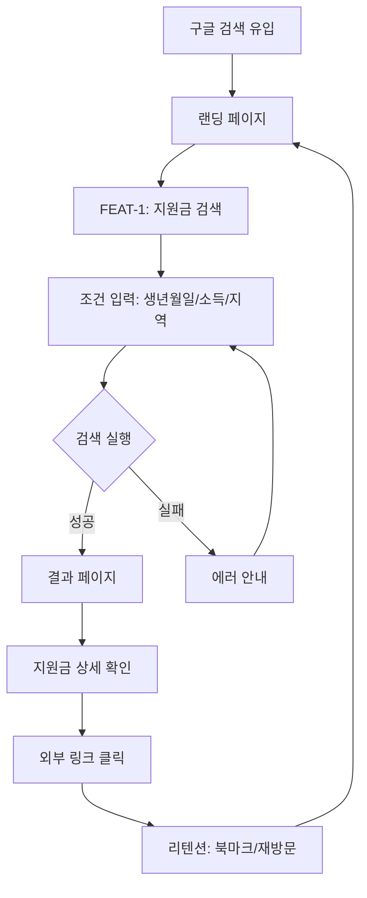
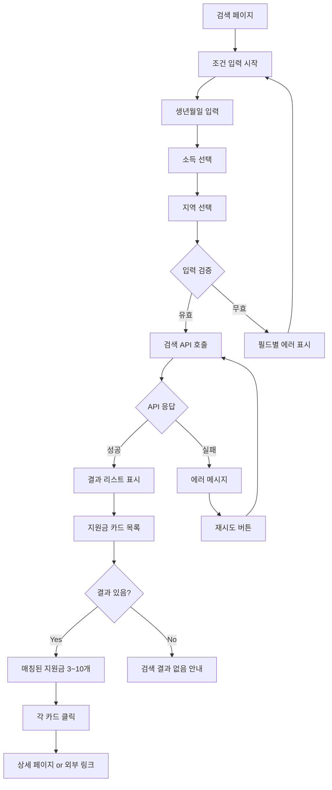
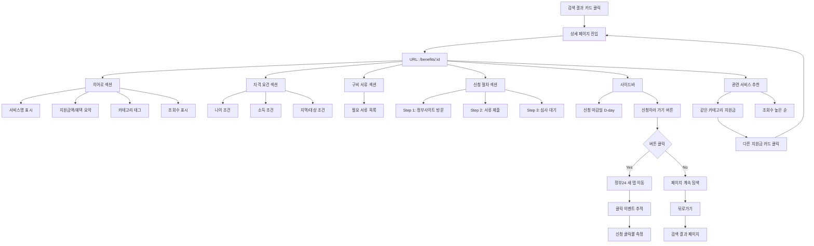

# User Flow (사용자 흐름도)

> Mermaid 플로우차트로 핵심 기능의 주요 여정을 표현합니다.
> 성공/실패 분기를 포함하고, 온보딩→핵심작업→리텐션 루프를 표현합니다.

---

## MVP 캡슐

| # | 항목 | 내용 |
|---|------|------|
| 1 | 목표 | 국민 누구나 공공데이터 기반으로 맞춤형 지원금을 쉽게 찾을 수 있는 서비스 제공 |
| 2 | 페르소나 | 모든 연령층 (학생, 직장인, 프리랜서, 주부, 은퇴자 등) |
| 3 | 핵심 기능 | FEAT-1: 생년월일/소득/지역 입력 맞춤형 지원금 매칭 |
| 4 | 성공 지표 (노스스타) | 월 애드센스 수익 목표 달성 |
| 5 | 입력 지표 | 일 방문자 수(DAU), 검색 전환율 |
| 6 | 비기능 요구 | SEO 최적화 (구글 검색 노출), 페이지 로딩 속도 < 3초 |
| 7 | Out-of-scope | 소셜 로그인, 이메일 알림, 복잡한 필터링은 v2 이후 |
| 8 | Top 리스크 | 공공데이터 API 불안정 또는 데이터 품질 문제 |
| 9 | 완화/실험 | 여러 공공 API 소스 통합, 데이터 캐싱 전략 수립 |
| 10 | 다음 단계 | Phase 0 계약 정의 및 테스트 케이스 작성 시작 |

---

## 1. 전체 사용자 여정 (Overview)



---

## 2. FEAT-0: 랜딩 페이지 플로우


---

## 3. FEAT-1: 지원금 검색 플로우



---

## 4. FEAT-1-3: 지원금 상세 페이지 플로우

> 검색 결과 카드 클릭 → 상세 페이지 → 신청하러 가기



### 상세 페이지 화면 구조

```
┌─────────────────────────────────────────────────────────────┐
│ [←] Home > 주거지원 > 청년월세지원                           │
├─────────────────────────────────────────────────────────────┤
│                                                             │
│  ┌─────────────────────────┐  ┌─────────────────────────┐  │
│  │ [8 cols] 메인 콘텐츠     │  │ [4 cols] 사이드바       │  │
│  │                         │  │                         │  │
│  │ ┌─────────────────────┐ │  │ ┌─────────────────────┐ │  │
│  │ │ 히어로 섹션          │ │  │ │ 신청 마감일         │ │  │
│  │ │ - 서비스명           │ │  │ │ D-5 (긴급)          │ │  │
│  │ │ - 월 20만원 지원     │ │  │ │                     │ │  │
│  │ │ - [주거] [청년]      │ │  │ │ ┌─────────────────┐ │ │  │
│  │ │ - 오늘 2,405회 조회  │ │  │ │ │ 신청하러 가기 → │ │ │  │
│  │ └─────────────────────┘ │  │ │ └─────────────────┘ │ │  │
│  │                         │  │ │                     │ │  │
│  │ ┌─────────────────────┐ │  │ │ ✓ 정부 공식 사이트  │ │  │
│  │ │ 자격 요건            │ │  │ │ 🔒 인증서 로그인   │ │  │
│  │ │ ✓ 19~39세           │ │  │ └─────────────────────┘ │  │
│  │ │ ✓ 중위소득 100%이하 │ │  │                         │  │
│  │ │ ✓ 서울 거주         │ │  │ [공유] [저장]           │  │
│  │ └─────────────────────┘ │  └─────────────────────────┘  │
│  │                         │                               │
│  │ ┌─────────────────────┐ │                               │
│  │ │ 구비 서류            │ │                               │
│  │ │ 📄 임대차계약서      │ │                               │
│  │ │ 📄 가족관계증명서    │ │                               │
│  │ │ 📄 통장사본          │ │                               │
│  │ └─────────────────────┘ │                               │
│  │                         │                               │
│  │ ┌─────────────────────┐ │                               │
│  │ │ 신청 절차            │ │                               │
│  │ │ ① 정부사이트 방문   │ │                               │
│  │ │ ② 서류 업로드       │ │                               │
│  │ │ ③ 심사 (2~3주)      │ │                               │
│  │ └─────────────────────┘ │                               │
│  └─────────────────────────┘                               │
│                                                             │
├─────────────────────────────────────────────────────────────┤
│ 관련 서비스 추천                                            │
│ ┌─────────┐ ┌─────────┐ ┌─────────┐                        │
│ │ 청년전세 │ │ 취업성공 │ │ 심리상담 │                        │
│ │ D-12    │ │ 상시    │ │ ~12/31  │                        │
│ └─────────┘ └─────────┘ └─────────┘                        │
└─────────────────────────────────────────────────────────────┘

[모바일] 하단 고정 바: [공유] [신청하러 가기 (D-5)]
```

---

## 5. 리텐션 루프 (재방문 유도)


---

## 6. 에러 처리 플로우

```mermaid
graph TD
    A[에러 발생] --> B{에러 유형?}

    B -->|네트워크 에러| C[연결 재시도 안내]
    B -->|입력 오류| D[필드별 에러 표시]
    B -->|API 타임아웃| E[잠시 후 재시도 안내]
    B -->|서버 오류| F[관리자에게 보고, 일반 에러 안내]

    C --> G{재시도?}
    G -->|Yes| H[재시도 실행]
    G -->|No| I[오프라인 안내]

    D --> J[사용자 수정]
    J --> K[재제출]

    E --> L[자동 재시도 3회]
    L --> M{성공?}
    M -->|Yes| N[결과 표시]
    M -->|No| F

    F --> O[고객센터 안내 (v2)]
```

---

## 7. 화면 목록 (Screen Inventory)

| 화면 ID | 화면명 | FEAT | 진입점 | 주요 액션 |
|---------|--------|------|--------|----------|
| S-01 | 랜딩 페이지 | FEAT-0 | 구글 검색 | 검색 시작 |
| S-02 | 검색 페이지 | FEAT-1 | S-01 CTA 버튼 | 생년월일/소득/지역 입력 |
| S-03 | 결과 페이지 | FEAT-1 | S-02 검색 실행 | 지원금 카드 목록 확인 |
| **S-04** | **상세 페이지** | **FEAT-1-3** | S-03 카드 클릭 | **히어로/자격/서류/절차 확인, 신청하러 가기** |
| S-05 | 에러 페이지 | - | 모든 화면 | 에러 안내, 재시도 |

### S-04 상세 페이지 구성 요소

| 섹션 | 컴포넌트 | 데이터 필드 | 비고 |
|------|----------|------------|------|
| 브레드크럼 | `Breadcrumb.vue` | category, name | Home > 카테고리 > 서비스명 |
| 히어로 | `BenefitHero.vue` | name, supportDetails, category, viewCount | 태그, 조회수 표시 |
| 자격 요건 | `EligibilityCard.vue` | targetAudience, selectionCriteria, minAge, maxAge | 체크 아이콘 |
| 구비 서류 | `DocumentsCard.vue` | requiredDocuments | 서류 목록 |
| 신청 절차 | `ProcessSteps.vue` | applicationMethod | 단계별 표시 |
| 사이드바 | `ApplySidebar.vue` | applicationDeadline, link | D-day, 신청 버튼 |
| 관련 추천 | `RelatedBenefits.vue` | category, viewCount | 3개 카드 |
| 모바일 바 | `MobileBottomBar.vue` | link, applicationDeadline | 하단 고정 |

---

## 8. 핵심 사용자 여정 시나리오

### 시나리오 1: 성공적인 첫 검색

1. 사용자가 구글에서 "청년 지원금 찾기" 검색
2. 검색 결과에서 "복지알리미" 클릭
3. 랜딩 페이지에서 3가지 조건 입력
   - 생년월일: 1998-06-15 (만 27세 자동 계산)
   - 소득: 0원 (구직 중)
   - 지역: 서울시 강남구
4. "지원금 찾기" 버튼 클릭
5. 3초 이내에 결과 페이지 로드
6. 매칭된 지원금 5개 표시
   - 청년도약계좌
   - 서울시 청년월세 지원
   - 국민취업지원제도
   - 서울시 청년수당
   - 청년내일채움공제
7. 각 지원금 카드에 예상 수령액 표시
8. "청년도약계좌" 클릭 → 상세 정보 확인 → 외부 링크 클릭
9. 사용자 만족, 북마크 저장

### 시나리오 2: 입력 오류 후 수정

1. 사용자가 검색 페이지 진입
2. 생년월일만 입력하고 소득/지역 누락
3. "지원금 찾기" 버튼 클릭
4. 필드별 에러 메시지 표시:
   - "소득을 선택해주세요"
   - "지역을 선택해주세요"
5. 사용자가 소득/지역 입력
6. 재시도 → 성공적으로 결과 표시

### 시나리오 3: API 장애 시 대응

1. 사용자가 검색 실행
2. 공공 API 타임아웃 발생
3. 자동 재시도 3회 실행
4. 모두 실패 시 에러 페이지 표시:
   - "일시적인 오류로 검색에 실패했습니다"
   - "잠시 후 다시 시도해주세요"
5. "재시도" 버튼 제공
6. 사용자 재시도 → 성공

---

## Decision Log 참조

| ID | 항목 | 선택 | 근거 |
|----|------|------|------|
| D-13 | 입력 필드 수 | 3개 (생년월일/소득/지역) | 생년월일로 만 나이 정확 계산 |
| D-14 | 검색 방식 | 즉시 검색 (버튼 클릭) | 자동 완성은 v2 이후 |
| D-15 | 결과 표시 | 카드 레이아웃 | 시각적 구분 명확, 스캔 용이 |
| D-16 | 에러 처리 | 재시도 3회 자동 | 사용자 편의성 고려 |
