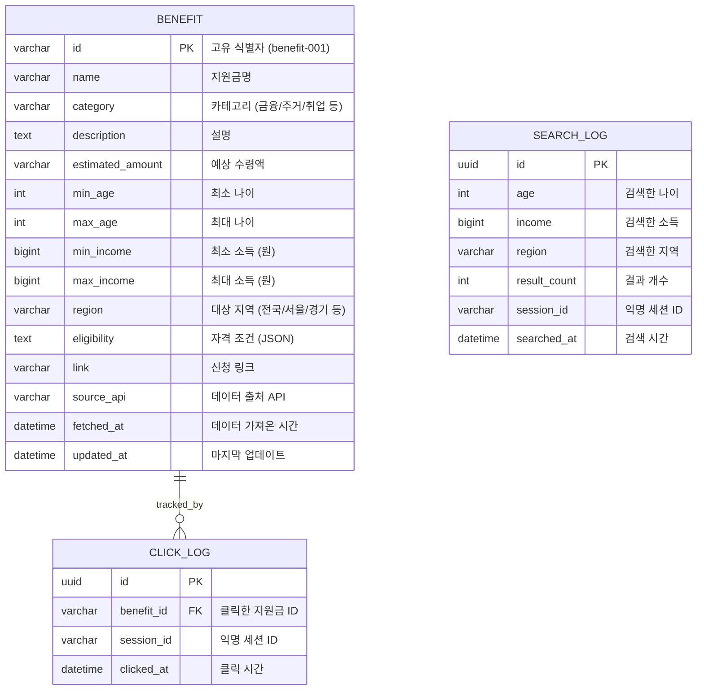
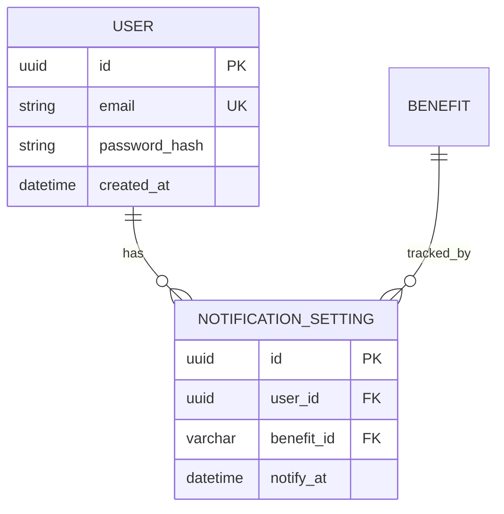

# Database Design (데이터베이스 설계)

> Mermaid ERD로 주요 엔티티와 관계를 표현합니다.
> 각 엔티티에 FEAT 주석을 달아 어떤 기능에서 사용되는지 명시합니다.
> 최소 수집 원칙을 반영하여 불필요한 개인정보는 지양합니다.

---

## MVP 캡슐

| # | 항목 | 내용 |
|---|------|------|
| 1 | 목표 | 국민 누구나 공공데이터 기반으로 맞춤형 지원금을 쉽게 찾을 수 있는 서비스 제공 |
| 2 | 페르소나 | 모든 연령층 (학생, 직장인, 프리랜서, 주부, 은퇴자 등) |
| 3 | 핵심 기능 | FEAT-1: 나이/소득/지역 입력 맞춤형 지원금 매칭 |
| 4 | 성공 지표 (노스스타) | 월 애드센스 수익 목표 달성 |
| 5 | 입력 지표 | 일 방문자 수(DAU), 검색 전환율 |
| 6 | 비기능 요구 | SEO 최적화 (구글 검색 노출), 페이지 로딩 속도 < 3초 |
| 7 | Out-of-scope | 소셜 로그인, 이메일 알림, 복잡한 필터링은 v2 이후 |
| 8 | Top 리스크 | 공공데이터 API 불안정 또는 데이터 품질 문제 |
| 9 | 완화/실험 | 여러 공공 API 소스 통합, 데이터 캐싱 전략 수립 |
| 10 | 다음 단계 | Phase 0 계약 정의 및 테스트 케이스 작성 시작 |

---

## 1. ERD (Entity Relationship Diagram)



---

## 2. 엔티티 상세 정의

### 2.1 BENEFIT (지원금) - FEAT-1

공공 API에서 가져온 지원금 데이터를 저장합니다.

| 컬럼 | 타입 | 제약조건 | 설명 |
|------|------|----------|------|
| id | VARCHAR(50) | PK | 고유 식별자 (예: benefit-001) |
| name | VARCHAR(200) | NOT NULL | 지원금명 (예: 청년도약계좌) |
| category | VARCHAR(50) | NOT NULL | 카테고리 (금융/주거/취업/의료 등) |
| description | TEXT | NULL | 지원금 설명 |
| estimated_amount | VARCHAR(100) | NULL | 예상 수령액 (예: 월 20만원, 5년 후 5,000만원) |
| min_age | INT | NULL | 최소 나이 (예: 19) |
| max_age | INT | NULL | 최대 나이 (예: 34) |
| min_income | BIGINT | NULL | 최소 소득 (원 단위, 0 = 무소득) |
| max_income | BIGINT | NULL | 최대 소득 (원 단위, NULL = 무제한) |
| region | VARCHAR(50) | NOT NULL | 대상 지역 (전국/서울/경기/... ) |
| eligibility | TEXT | NULL | 자격 조건 JSON (복잡한 조건 저장) |
| link | VARCHAR(500) | NOT NULL | 신청 링크 (공식 사이트) |
| source_api | VARCHAR(100) | NOT NULL | 데이터 출처 (보조금24/서울시 등) |
| fetched_at | DATETIME | NOT NULL | 데이터 가져온 시간 |
| updated_at | DATETIME | NOT NULL | 마지막 업데이트 시간 |

**인덱스:**
- `idx_benefit_age` ON (min_age, max_age)
- `idx_benefit_income` ON (min_income, max_income)
- `idx_benefit_region` ON region
- `idx_benefit_category` ON category

**최소 수집 원칙 적용:**
- 개인정보 수집 안 함
- 공공 API 데이터만 저장

### 2.2 SEARCH_LOG (검색 로그) - FEAT-1

사용자 검색 패턴 분석용 익명 로그입니다.

| 컬럼 | 타입 | 제약조건 | 설명 |
|------|------|----------|------|
| id | UUID | PK | 고유 식별자 |
| age | INT | NOT NULL | 검색한 나이 |
| income | BIGINT | NOT NULL | 검색한 소득 (원 단위) |
| region | VARCHAR(50) | NOT NULL | 검색한 지역 |
| result_count | INT | NOT NULL | 검색 결과 개수 |
| session_id | VARCHAR(100) | NOT NULL | 익명 세션 ID (브라우저 fingerprint) |
| searched_at | DATETIME | NOT NULL, DEFAULT NOW() | 검색 시간 |

**인덱스:**
- `idx_search_log_date` ON searched_at DESC
- `idx_search_log_session` ON session_id

**프라이버시 보호:**
- 개인 식별 정보 없음
- 세션 ID는 익명화된 fingerprint
- IP 주소 저장 안 함

### 2.3 CLICK_LOG (클릭 로그) - FEAT-1

사용자가 어떤 지원금을 클릭했는지 추적합니다.

| 컬럼 | 타입 | 제약조건 | 설명 |
|------|------|----------|------|
| id | UUID | PK | 고유 식별자 |
| benefit_id | VARCHAR(50) | FK → BENEFIT.id, NOT NULL | 클릭한 지원금 ID |
| session_id | VARCHAR(100) | NOT NULL | 익명 세션 ID |
| clicked_at | DATETIME | NOT NULL, DEFAULT NOW() | 클릭 시간 |

**인덱스:**
- `idx_click_log_benefit` ON benefit_id
- `idx_click_log_date` ON clicked_at DESC

---

## 3. 관계 정의

| 부모 | 자식 | 관계 | 설명 |
|------|------|------|------|
| BENEFIT | CLICK_LOG | 1:N | 하나의 지원금은 여러 클릭 로그를 가짐 |

---

## 4. 데이터 생명주기

| 엔티티 | 생성 시점 | 보존 기간 | 삭제/익명화 |
|--------|----------|----------|------------|
| BENEFIT | 공공 API 동기화 시 | 영구 (매일 갱신) | 업데이트 주기: 24시간 |
| SEARCH_LOG | 사용자 검색 시 | 1년 | 1년 후 자동 삭제 |
| CLICK_LOG | 사용자 클릭 시 | 1년 | 1년 후 자동 삭제 |

### 4.1 BENEFIT 데이터 동기화 전략

**출처**: 행정안전부 보조금24 API

**동기화 방식**:
1. **주기적 동기화 (크론잡)**: 매일 새벽 2시 실행
2. **전체 데이터 갱신**: API에서 모든 서비스 목록 가져오기
3. **Upsert 방식**: 기존 데이터 업데이트 또는 새 데이터 삽입

**동기화 흐름**:
```
1. API 호출 (/gov24/v3/serviceList) - 페이징 처리
2. 각 서비스별 지원조건 조회 (/gov24/v3/supportConditions)
3. 데이터 변환 (보조금24 형식 → BENEFIT 모델)
4. DB Upsert (Prisma)
   - WHERE: id (서비스ID)
   - UPDATE: 모든 필드 + fetched_at, updated_at
   - CREATE: 새 레코드 생성
5. Rate Limiting: 요청 간 1초 대기
```

**구현 파일**:
- `backend/src/services/publicApiClient.ts` - API 클라이언트
- `backend/src/services/syncBenefits.ts` - 동기화 스크립트
- `backend/package.json` - `npm run sync:benefits` 스크립트

**데이터 매핑**:
| 보조금24 API | BENEFIT 컬럼 |
|-------------|-------------|
| 서비스ID | id |
| 서비스명 | name |
| 서비스분야 | category |
| 서비스목적요약 | description |
| 서비스상세URL | link |
| supportConditions.최소연령 | min_age |
| supportConditions.최대연령 | max_age |
| supportConditions.거주지역 | region |
| - | source_api = '보조금24' |

**장애 대응**:
- API 장애 시: 기존 캐시 데이터 사용 (fetched_at 확인)
- 타임아웃: 10초 후 재시도 (최대 3회)
- 부분 실패: 성공한 데이터만 저장, 에러 로깅

---

## 5. 쿼리 패턴 (주요 조회)

### 5.1 지원금 검색 쿼리

```sql
SELECT *
FROM BENEFIT
WHERE
  (min_age IS NULL OR min_age <= :age)
  AND (max_age IS NULL OR max_age >= :age)
  AND (min_income IS NULL OR min_income <= :income)
  AND (max_income IS NULL OR max_income >= :income)
  AND (region = :region OR region = '전국')
ORDER BY
  fetched_at DESC
LIMIT 10;
```

### 5.2 인기 지원금 조회 (클릭 수 기반)

```sql
SELECT b.*, COUNT(c.id) AS click_count
FROM BENEFIT b
LEFT JOIN CLICK_LOG c ON b.id = c.benefit_id
WHERE c.clicked_at >= DATE_SUB(NOW(), INTERVAL 7 DAY)
GROUP BY b.id
ORDER BY click_count DESC
LIMIT 5;
```

### 5.3 검색 트렌드 분석

```sql
SELECT
  region,
  COUNT(*) AS search_count,
  AVG(result_count) AS avg_results
FROM SEARCH_LOG
WHERE searched_at >= DATE_SUB(NOW(), INTERVAL 7 DAY)
GROUP BY region
ORDER BY search_count DESC;
```

---

## 6. 확장 고려사항

### 6.1 v2에서 추가 예정 엔티티



### 6.2 인덱스 전략

- **읽기 최적화**: 검색 조건(나이/소득/지역)에 복합 인덱스 추가
- **쓰기 고려**: 로그 테이블은 인덱스 최소화 (삽입 성능 우선)
- **복합 인덱스**: 자주 함께 조회되는 컬럼 조합

### 6.3 샤딩 전략 (v3 이후)

- **수평 샤딩**: region 기준으로 샤딩 (서울/경기/전국 등)
- **캐싱**: Redis로 인기 지원금 캐싱 (24시간 TTL)

---

## 7. 샘플 데이터

### 7.1 BENEFIT 샘플

```json
{
  "id": "benefit-001",
  "name": "청년도약계좌",
  "category": "금융지원",
  "description": "청년의 자산 형성을 지원하는 적금 상품",
  "estimated_amount": "5년 후 5,000만원",
  "min_age": 19,
  "max_age": 34,
  "min_income": 0,
  "max_income": 75000000,
  "region": "전국",
  "eligibility": ["19~34세", "연소득 7,500만원 이하"],
  "link": "https://www.kinfa.or.kr/",
  "source_api": "보조금24",
  "fetched_at": "2026-01-13 10:00:00",
  "updated_at": "2026-01-13 10:00:00"
}
```

---

## Decision Log 참조

| ID | 항목 | 선택 | 근거 |
|----|------|------|------|
| D-17 | 개인정보 저장 | 안 함 | 프라이버시 보호, 익명 검색 |
| D-18 | 로그 보존 기간 | 1년 | 분석 충분, 저장 비용 최소화 |
| D-19 | 인덱스 전략 | 검색 조건 3개 복합 인덱스 | 검색 성능 최적화 |
| D-20 | 데이터 갱신 주기 | 24시간 | API 부하 최소화, 데이터 신선도 유지 |
