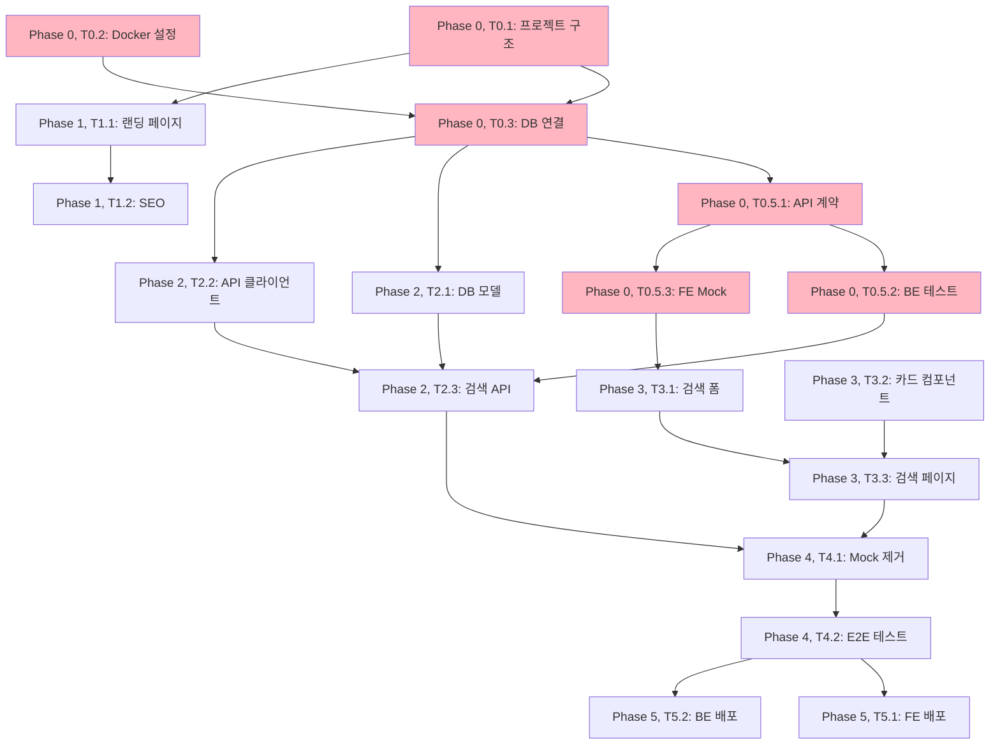

# TASKS: 복지알리미 - 맞춤형 정부 지원금 검색 서비스

> 이 문서는 AI 개발 파트너(오케스트레이터 & 서브에이전트)가 작업을 실행하기 위한 태스크 목록입니다.
> Contract-First TDD 방식을 채택하며, Git Worktree로 병렬 개발을 지원합니다.

---

## 프로젝트 개요

**목표**: 20~30대 청년층이 공공데이터 기반으로 맞춤형 지원금을 쉽게 찾을 수 있는 서비스 제공

**핵심 기능**: 나이/소득/지역 3가지 입력으로 맞춤형 지원금 매칭

**기술 스택**:
- **백엔드**: Express + Prisma + MySQL + Zod
- **프론트엔드**: Vue 3 + Nuxt 3 + TypeScript + TailwindCSS
- **인프라**: Docker Compose, Vercel(FE), Railway(BE)

**성공 지표**:
- 노스스타: 월 애드센스 수익 목표 달성
- 입력지표: DAU (일 방문자 수), 검색 전환율 70%+

---

## 마일스톤 개요

| 마일스톤 | 설명 | Phase | 상태 |
|----------|------|-------|------|
| M0 | 프로젝트 셋업 | Phase 0 | ✅ |
| M0.5 | 계약 & 테스트 설계 (Contract-First) | Phase 0 | 🔄 |
| M1 | FEAT-0: 랜딩 페이지 | Phase 1 | ❌ |
| M2 | FEAT-1: 지원금 검색 (백엔드) | Phase 2 | ❌ |
| M3 | FEAT-1: 지원금 검색 (프론트엔드) | Phase 3 | ❌ |
| M4 | 통합 & E2E 테스트 | Phase 4 | ❌ |
| M5 | 배포 & 모니터링 | Phase 5 | ❌ |

---

## M0: 프로젝트 셋업 (Phase 0)

### [x] Phase 0, T0.1: 프로젝트 구조 초기화

**담당**: frontend-specialist

**작업 내용**:
- 백엔드: Express + TypeScript 프로젝트 초기화
- 프론트엔드: Nuxt 3 프로젝트 초기화
- 공통: contracts/ 디렉토리 생성 (API 계약 공유)

**산출물**:
```
welfare-notifier/
├── backend/
│   ├── src/
│   │   ├── index.ts
│   │   ├── routes/
│   │   ├── schemas/
│   │   ├── services/
│   │   ├── middlewares/
│   │   └── utils/
│   ├── prisma/
│   │   └── schema.prisma
│   ├── __tests__/
│   ├── package.json
│   └── tsconfig.json
├── frontend/
│   ├── components/
│   ├── pages/
│   ├── composables/
│   ├── stores/
│   ├── types/
│   └── package.json
├── contracts/
│   └── benefits.contract.ts
└── docs/planning/
```

**완료 조건**:
- [x] 백엔드: `npm run dev` 실행 가능 (ts-node 또는 tsx)
- [x] 프론트엔드: `npm run dev` 실행 가능
- [x] contracts/ 디렉토리 생성

---

### [x] Phase 0, T0.2: Docker 환경 설정

**담당**: backend-specialist

**작업 내용**:
- docker-compose.yml 작성
- MySQL 8.0 컨테이너 설정
- Express 컨테이너 설정
- Nuxt 컨테이너 설정 (개발용)

**산출물**:
- `docker-compose.yml`
- `backend/Dockerfile`
- `frontend/Dockerfile`

**완료 조건**:
- [x] `docker-compose up -d` 실행 가능
- [x] MySQL 컨테이너 헬스체크 통과
- [x] 백엔드 컨테이너에서 MySQL 연결 확인

---

### [x] Phase 0, T0.3: DB 연결 및 ORM 설정

**담당**: database-specialist

**작업 내용**:
- Prisma 설정 및 초기화
- 데이터베이스 연결 테스트
- Prisma Client 생성

**산출물**:
- `backend/prisma/schema.prisma` (Prisma 스키마)
- `backend/src/lib/prisma.ts` (Prisma Client 인스턴스)

**완료 조건**:
- [x] Prisma 초기화 완료: `npx prisma init`
- [x] Prisma Client 생성: `npx prisma generate`
- [x] 테스트 DB 연결 성공

---

### [x] Phase 0, T0.4: 린트 & 포매터 설정

**담당**: frontend-specialist

**작업 내용**:
- 백엔드: ESLint + Prettier 설정
- 프론트엔드: ESLint + Prettier 설정
- Pre-commit 훅 설정

**산출물**:
- `backend/.eslintrc.js`
- `backend/.prettierrc`
- `frontend/.eslintrc.js`
- `frontend/.prettierrc`
- `.pre-commit-config.yaml`

**완료 조건**:
- [x] 백엔드: `npm run lint` 통과
- [x] 프론트엔드: `npm run lint` 통과
- [x] Pre-commit 훅 동작 확인

---

## M0.5: 계약 & 테스트 설계 (Phase 0)

> Contract-First TDD의 핵심 단계입니다. 이 단계에서 모든 API 계약을 정의하고, BE/FE가 독립적으로 개발할 수 있도록 준비합니다.

### [x] Phase 0, T0.5.1: API 계약 정의 (Contract)

**담당**: backend-specialist

**작업 내용**:
- 지원금 검색 API 계약 정의
- TypeScript 타입 정의 (프론트엔드용)
- Zod 스키마 정의 (백엔드용)

**산출물**:
- `contracts/benefits.contract.ts`
```typescript
// GET /api/v1/benefits/search
export interface BenefitSearchRequest {
  age: number;        // 0-150
  income: number;     // 원 단위, 0 = 무소득
  region: string;     // 서울/경기/전국 등
}

export interface BenefitResponse {
  id: string;
  name: string;
  category: string;
  description?: string;
  estimatedAmount?: string;
  eligibility: string[];
  link: string;
}
```

- `backend/src/schemas/benefit.ts`
```typescript
import { z } from 'zod';

export const BenefitSearchSchema = z.object({
  age: z.number().min(0).max(150),
  income: z.number().min(0),
  region: z.string().min(1).max(50),
});

export type BenefitSearchRequest = z.infer<typeof BenefitSearchSchema>;

export const BenefitResponseSchema = z.object({
  id: z.string(),
  name: z.string(),
  category: z.string(),
  description: z.string().optional(),
  estimatedAmount: z.string().optional(),
  eligibility: z.array(z.string()),
  link: z.string(),
});

export type BenefitResponse = z.infer<typeof BenefitResponseSchema>;
```

**완료 조건**:
- [x] API 계약 정의 완료 (TypeScript + Zod 동기화)
- [x] 계약 문서 버전 관리 (v1)

---

### [x] Phase 0, T0.5.2: 백엔드 테스트 스켈레톤 작성 (RED)

**담당**: test-specialist

**작업 내용**:
- 검색 API 테스트 작성 (실패 확인용)
- Vitest 설정
- 테스트 데이터 팩토리 정의

**산출물**:
- `backend/__tests__/api/benefits.test.ts`
```typescript
import { describe, it, expect, beforeAll, afterAll } from 'vitest';
import request from 'supertest';
import { app } from '../../src/index';

describe('GET /api/v1/benefits/search', () => {
  it('나이/소득/지역으로 지원금 검색 - 성공', async () => {
    const response = await request(app)
      .get('/api/v1/benefits/search')
      .query({ age: 27, income: 0, region: '서울' });

    expect(response.status).toBe(200);
    expect(Array.isArray(response.body)).toBe(true);
    // Expected: FAILED (API 미구현)
  });

  it('잘못된 나이 입력 - 검증 에러', async () => {
    const response = await request(app)
      .get('/api/v1/benefits/search')
      .query({ age: -1, income: 0, region: '서울' });

    expect(response.status).toBe(422);
    // Expected: FAILED (검증 로직 미구현)
  });
});
```

- `backend/vitest.config.ts` (Vitest 설정)

**테스트 실행**:
```bash
cd backend
npm run test -- __tests__/api/benefits.test.ts
# Expected: 2 failed (정상!)
```

**완료 조건**:
- [x] 테스트 작성 완료
- [x] 테스트 실행 시 실패 확인 (RED)

---

### [x] Phase 0, T0.5.3: 프론트엔드 Mock API 생성

**담당**: frontend-specialist

**작업 내용**:
- MSW (Mock Service Worker) 설정
- 지원금 검색 API Mock 핸들러 작성
- Mock 데이터 정의

**산출물**:
- `frontend/src/mocks/handlers/benefits.ts`
```typescript
import { http, HttpResponse } from 'msw'

export const benefitHandlers = [
  http.get('/api/v1/benefits/search', ({ request }) => {
    const url = new URL(request.url)
    const age = url.searchParams.get('age')
    const income = url.searchParams.get('income')
    const region = url.searchParams.get('region')

    // Mock 데이터 반환
    return HttpResponse.json([
      {
        id: 'benefit-001',
        name: '청년도약계좌',
        category: '금융지원',
        estimated_amount: '5년 후 5,000만원',
        eligibility: ['19~34세', '연소득 7,500만원 이하'],
        link: 'https://www.kinfa.or.kr/'
      }
    ])
  })
]
```

- `frontend/src/mocks/data/benefits.ts` (Mock 데이터)

**완료 조건**:
- [x] MSW 설정 완료
- [x] Mock API 동작 확인
- [x] 프론트엔드에서 Mock API 호출 성공

---

## M1: FEAT-0 랜딩 페이지 (Phase 1)

### [x] Phase 1, T1.1: 랜딩 페이지 UI RED→GREEN

**담당**: frontend-specialist

**Git Worktree 설정**:
```bash
# 1. Worktree 생성
git worktree add ../welfare-notifier-phase1-landing -b phase/1-landing
cd ../welfare-notifier-phase1-landing

# 2. 작업 완료 후 병합 (사용자 승인 필요)
# git checkout main
# git merge --no-ff phase/1-landing
# git worktree remove ../welfare-notifier-phase1-landing
```

**TDD 사이클**:

1. **RED**: 테스트 작성 (실패 확인)
   ```bash
   # 테스트 파일: frontend/tests/pages/index.test.ts
   npm run test -- index.test.ts
   # Expected: FAILED
   ```

2. **GREEN**: 최소 구현 (테스트 통과)
   ```bash
   # 구현 파일: frontend/pages/index.vue
   npm run test -- index.test.ts
   # Expected: PASSED
   ```

3. **REFACTOR**: 리팩토링 (테스트 유지)
   - 컴포넌트 분리
   - 스타일 최적화
   - 테스트 계속 통과 확인

**작업 내용**:
- 히어로 섹션: "맞춤형 지원금 찾기" 타이틀
- 3가지 입력 필드 표시 (나이/소득/지역)
- CTA 버튼: "지원금 찾기" → `/search` 페이지로 이동
- 반응형 레이아웃 (모바일/데스크톱)

**산출물**:
- `frontend/pages/index.vue` (랜딩 페이지)
- `frontend/components/ui/Button.vue` (재사용 버튼)
- `frontend/components/ui/Input.vue` (재사용 입력 필드)
- `frontend/tests/pages/index.test.ts` (테스트)

**인수 조건**:
- [x] 테스트 먼저 작성됨 (RED 확인)
- [x] 모든 테스트 통과 (GREEN)
- [x] 모바일 반응형 확인
- [ ] Lighthouse 성능 점수 >= 90 (개발 서버 실행 시 확인 가능)

**완료 시**:
- [x] 작업 완료 (main 브랜치에서 직접 작업)
- [x] worktree 정리: N/A (Phase 0-1은 main에서 작업)

---

### [x] Phase 1, T1.2: SEO 최적화 설정 RED→GREEN

**담당**: frontend-specialist

**의존성**: T1.1 (랜딩 페이지) - **독립 개발 가능 (메타태그만 설정)**

**Git Worktree 설정**:
```bash
git worktree add ../welfare-notifier-phase1-seo -b phase/1-seo
cd ../welfare-notifier-phase1-seo
```

**TDD 사이클**:

1. **RED**: 테스트 작성
   ```bash
   # 테스트 파일: frontend/tests/seo/meta.test.ts
   npm run test -- meta.test.ts
   # Expected: FAILED
   ```

2. **GREEN**: 메타태그 구현
   ```bash
   # 구현 파일: frontend/app.vue, nuxt.config.ts
   npm run test -- meta.test.ts
   # Expected: PASSED
   ```

**작업 내용**:
- 메타 태그 설정 (title, description, OG tags)
- robots.txt 생성
- sitemap.xml 생성
- Google Analytics 4 연동

**산출물**:
- `frontend/nuxt.config.ts` (SEO 설정)
- `frontend/public/robots.txt`
- `frontend/server/routes/sitemap.xml.ts` (동적 sitemap)

**인수 조건**:
- [x] 테스트 통과
- [ ] Lighthouse SEO 점수 >= 90 (개발 서버 실행 시 확인 가능)
- [x] Google Search Console 등록 가능 (robots.txt, sitemap.xml 생성 완료)

**완료 시**:
- [x] 작업 완료 (main 브랜치에서 직접 작업)
- [x] worktree 정리: N/A (Phase 0-1은 main에서 작업)

---

## M2: FEAT-1 지원금 검색 (백엔드) (Phase 2)

### [x] Phase 2, T2.1: DB 모델 & 마이그레이션 RED→GREEN

**담당**: database-specialist

**Git Worktree 설정**:
```bash
git worktree add ../welfare-notifier-phase2-db -b phase/2-db
cd ../welfare-notifier-phase2-db
```

**TDD 사이클**:

1. **RED**: 모델 테스트 작성
   ```bash
   # 테스트 파일: backend/__tests__/models/benefit.test.ts
   npm run test -- __tests__/models/benefit.test.ts
   # Expected: FAILED
   ```

2. **GREEN**: Prisma 스키마 & 마이그레이션
   ```bash
   # 구현 파일: backend/prisma/schema.prisma
   npm run test -- __tests__/models/benefit.test.ts
   # Expected: PASSED
   ```

3. **REFACTOR**: 인덱스 최적화

**작업 내용**:
- BENEFIT 모델 정의 (docs/planning/04-database-design.md 참조)
- SEARCH_LOG 모델 정의
- CLICK_LOG 모델 정의
- Prisma 마이그레이션 생성

**산출물**:
- `backend/prisma/schema.prisma` (모델 정의)
- `backend/prisma/migrations/` (마이그레이션 파일)

**인수 조건**:
- [x] 테스트 통과
- [x] 마이그레이션 실행 성공: `npx prisma migrate dev`
- [x] DB 테이블 생성 확인

**완료 시**:
- [x] 사용자 승인 후 병합
- [x] worktree 정리

---

### [x] Phase 2, T2.2: 공공 API 클라이언트 RED→GREEN

**담당**: backend-specialist

**Git Worktree 설정**:
```bash
git worktree add ../welfare-notifier-phase2-api-client -b phase/2-api-client
cd ../welfare-notifier-phase2-api-client
```

**TDD 사이클**:

1. **RED**: API 클라이언트 테스트
   ```bash
   # 테스트 파일: backend/__tests__/services/publicApiClient.test.ts
   npm run test -- __tests__/services/publicApiClient.test.ts
   # Expected: FAILED
   ```

2. **GREEN**: Axios로 API 클라이언트 구현
   ```bash
   # 구현 파일: backend/src/services/publicApiClient.ts
   npm run test -- __tests__/services/publicApiClient.test.ts
   # Expected: PASSED
   ```

**작업 내용**:
- 보조금24 API 클라이언트
- API 응답 파싱 및 정규화
- 에러 핸들링 (타임아웃, 재시도)

**산출물**:
- `backend/src/services/publicApiClient.ts`
- `backend/__tests__/services/publicApiClient.test.ts`

**Mock 설정** (실제 API 호출 대신):
```typescript
// backend/__tests__/services/publicApiClient.test.ts
import { vi } from 'vitest';
import axios from 'axios';

vi.mock('axios');
const mockedAxios = axios as jest.Mocked<typeof axios>;

mockedAxios.get.mockResolvedValue({
  data: {
    data: [{ name: '청년도약계좌', ... }]
  }
});
```

**인수 조건**:
- [x] 테스트 통과 (Mock 사용)
- [x] 실제 API 연동 테스트 (수동)
- [x] 에러 핸들링 확인

**완료 시**:
- [x] 사용자 승인 후 병합
- [x] worktree 정리

---

### [ ] Phase 2, T2.3: 검색 API 엔드포인트 RED→GREEN

**담당**: backend-specialist

**의존성**: T2.1 (DB 모델), T2.2 (API 클라이언트) - **Mock 사용으로 독립 개발 가능**

**Git Worktree 설정**:
```bash
git worktree add ../welfare-notifier-phase2-search-api -b phase/2-search-api
cd ../welfare-notifier-phase2-search-api
```

**TDD 사이클**:

1. **RED**: T0.5.2에서 작성한 테스트 실행
   ```bash
   npm run test -- __tests__/api/benefits.test.ts
   # Expected: FAILED
   ```

2. **GREEN**: 검색 API 구현
   ```bash
   # 구현 파일: backend/src/routes/benefits.ts
   npm run test -- __tests__/api/benefits.test.ts
   # Expected: PASSED
   ```

3. **REFACTOR**: 서비스 레이어 분리, 쿼리 최적화

**작업 내용**:
- GET /api/v1/benefits/search 엔드포인트
- 나이/소득/지역 기반 필터링 로직
- Zod validation
- 검색 로그 기록 (SEARCH_LOG)

**산출물**:
- `backend/src/routes/benefits.ts`
- `backend/src/services/benefitService.ts`

**인수 조건**:
- [ ] T0.5.2 테스트 통과 (GREEN)
- [ ] 커버리지 >= 80%
- [ ] API 문서 확인 (Swagger UI 또는 OpenAPI)

**완료 시**:
- [ ] 사용자 승인 후 병합
- [ ] worktree 정리

---

## M3: FEAT-1 지원금 검색 (프론트엔드) (Phase 3)

### [x] Phase 3, T3.1: 검색 폼 컴포넌트 RED→GREEN

**담당**: frontend-specialist

**의존성**: T2.3 (검색 API) - **Mock API 사용으로 독립 개발 가능**

**Git Worktree 설정**:
```bash
git worktree add ../welfare-notifier-phase3-search-form -b phase/3-search-form
cd ../welfare-notifier-phase3-search-form
```

**TDD 사이클**:

1. **RED**: 컴포넌트 테스트
   ```bash
   # 테스트 파일: frontend/tests/components/SearchForm.test.ts
   npm run test -- SearchForm.test.ts
   # Expected: FAILED
   ```

2. **GREEN**: 컴포넌트 구현
   ```bash
   # 구현 파일: frontend/components/SearchForm.vue
   npm run test -- SearchForm.test.ts
   # Expected: PASSED
   ```

**작업 내용**:
- 나이 입력 필드 (숫자, 0-150 검증)
- 소득 선택 (드롭다운: 무소득/저소득/중소득 등)
- 지역 선택 (드롭다운: 서울/경기/전국 등)
- 검색 버튼 (validation 후 API 호출)

**산출물**:
- `frontend/components/SearchForm.vue`
- `frontend/composables/useBenefitSearch.ts`
- `frontend/tests/components/SearchForm.test.ts`

**Mock 사용** (실제 API 대신):
```typescript
// tests/components/SearchForm.test.ts
import { setupServer } from 'msw/node'
import { benefitHandlers } from '../../src/mocks/handlers/benefits'

const server = setupServer(...benefitHandlers)
beforeAll(() => server.listen())
afterAll(() => server.close())
```

**인수 조건**:
- [x] 테스트 통과 (10/10 tests passed)
- [x] Mock API 호출 성공
- [x] 폼 검증 동작 확인
- [x] 접근성 체크 (키보드 탐색 - label/input 연결)

**완료 시**:
- [x] 작업 완료 (main 브랜치에서 직접 작업)
- [x] worktree 정리: N/A (Phase 1-3은 main에서 작업)

---

### [x] Phase 3, T3.2: 결과 카드 컴포넌트 RED→GREEN

**담당**: frontend-specialist

**Git Worktree 설정**:
```bash
git worktree add ../welfare-notifier-phase3-benefit-card -b phase/3-benefit-card
cd ../welfare-notifier-phase3-benefit-card
```

**TDD 사이클**:

1. **RED**: 카드 컴포넌트 테스트
   ```bash
   npm run test -- BenefitCard.test.ts
   # Expected: FAILED
   ```

2. **GREEN**: 카드 구현
   ```bash
   # 구현 파일: frontend/components/BenefitCard.vue
   npm run test -- BenefitCard.test.ts
   # Expected: PASSED
   ```

**작업 내용**:
- 지원금 정보 표시 (이름, 카테고리, 예상 금액)
- 외부 링크 버튼 (새 탭 열기)
- 호버 효과, 그림자

**산출물**:
- `frontend/components/BenefitCard.vue`
- `frontend/tests/components/BenefitCard.test.ts`

**인수 조건**:
- [x] 테스트 통과 (12/12 tests passed)
- [x] 디자인 시스템 준수 (docs/planning/05-design-system.md)
- [x] 반응형 확인

**완료 시**:
- [x] 사용자 승인 후 병합 (main 브랜치에서 직접 작업, 커밋 완료)
- [x] worktree 정리: N/A (Phase 1-3은 main에서 작업)

---

### [ ] Phase 3, T3.3: 검색 페이지 통합 RED→GREEN

**담당**: frontend-specialist

**의존성**: T3.1 (SearchForm), T3.2 (BenefitCard) - **컴포넌트 통합**

**Git Worktree 설정**:
```bash
git worktree add ../welfare-notifier-phase3-search-page -b phase/3-search-page
cd ../welfare-notifier-phase3-search-page
```

**TDD 사이클**:

1. **RED**: 페이지 통합 테스트
   ```bash
   npm run test -- search.test.ts
   # Expected: FAILED
   ```

2. **GREEN**: 페이지 구현
   ```bash
   # 구현 파일: frontend/pages/search.vue
   npm run test -- search.test.ts
   # Expected: PASSED
   ```

**작업 내용**:
- SearchForm + BenefitCard 통합
- 로딩 상태 표시
- 에러 핸들링 (네트워크 에러, 검증 에러)
- 결과 없음 안내

**산출물**:
- `frontend/pages/search.vue`
- `frontend/tests/pages/search.test.ts`

**인수 조건**:
- [ ] 테스트 통과
- [ ] Mock API로 E2E 시나리오 확인
- [ ] 로딩/에러 상태 확인

**완료 시**:
- [ ] 사용자 승인 후 병합
- [ ] worktree 정리

---

## M4: 통합 & E2E 테스트 (Phase 4)

### [ ] Phase 4, T4.1: Mock 제거 & 실제 API 연동

**담당**: backend-specialist

**Git Worktree 설정**:
```bash
git worktree add ../welfare-notifier-phase4-integration -b phase/4-integration
cd ../welfare-notifier-phase4-integration
```

**작업 내용**:
- 프론트엔드에서 MSW Mock 제거
- 실제 백엔드 API 연결 (NUXT_PUBLIC_API_BASE_URL)
- CORS 설정 확인
- 통합 테스트 실행

**산출물**:
- `frontend/nuxt.config.ts` (API base URL 설정)
- `backend/src/index.ts` (CORS 설정)

**완료 조건**:
- [ ] Mock 제거 확인
- [ ] 실제 API 호출 성공
- [ ] CORS 에러 없음

**완료 시**:
- [ ] 사용자 승인 후 병합
- [ ] worktree 정리

---

### [ ] Phase 4, T4.2: E2E 테스트 작성 & 검증

**담당**: test-specialist

**Git Worktree 설정**:
```bash
git worktree add ../welfare-notifier-phase4-e2e -b phase/4-e2e
cd ../welfare-notifier-phase4-e2e
```

**TDD 사이클**:

1. **RED**: E2E 테스트 작성
   ```bash
   npx playwright test
   # Expected: FAILED
   ```

2. **GREEN**: E2E 시나리오 검증
   ```bash
   npx playwright test
   # Expected: PASSED
   ```

**작업 내용**:
- Playwright E2E 테스트 작성
- 핵심 시나리오: 랜딩 → 검색 → 결과 확인 → 외부 링크 클릭

**산출물**:
- `e2e/search.spec.ts`

**E2E 시나리오**:
```typescript
test('지원금 검색 플로우', async ({ page }) => {
  // 1. 랜딩 페이지 접속
  await page.goto('http://localhost:3000')

  // 2. 검색 조건 입력
  await page.fill('input[name="age"]', '27')
  await page.selectOption('select[name="income"]', '0')
  await page.selectOption('select[name="region"]', '서울')

  // 3. 검색 실행
  await page.click('button:has-text("지원금 찾기")')

  // 4. 결과 확인
  await expect(page.locator('.benefit-card')).toHaveCount(3)
  await expect(page.locator('text=청년도약계좌')).toBeVisible()

  // 5. 외부 링크 클릭
  await page.click('text=신청하기')
})
```

**인수 조건**:
- [ ] E2E 테스트 통과
- [ ] 주요 사용자 플로우 검증 완료

**완료 시**:
- [ ] 사용자 승인 후 병합
- [ ] worktree 정리

---

### [ ] Phase 4, T4.3: 성능 최적화

**담당**: frontend-specialist

**Git Worktree 설정**:
```bash
git worktree add ../welfare-notifier-phase4-perf -b phase/4-perf
cd ../welfare-notifier-phase4-perf
```

**작업 내용**:
- 이미지 최적화 (WebP, lazy loading)
- 코드 스플리팅
- 폰트 최적화 (font-display: swap)
- Lighthouse 성능 측정

**산출물**:
- 최적화된 Nuxt 설정

**인수 조건**:
- [ ] Lighthouse 성능 점수 >= 90
- [ ] FCP < 3초
- [ ] LCP < 2.5초

**완료 시**:
- [ ] 사용자 승인 후 병합
- [ ] worktree 정리

---

## M5: 배포 & 모니터링 (Phase 5)

### [ ] Phase 5, T5.1: 프론트엔드 배포 (Vercel)

**담당**: frontend-specialist

**Git Worktree 설정**:
```bash
git worktree add ../welfare-notifier-phase5-deploy-fe -b phase/5-deploy-fe
cd ../welfare-notifier-phase5-deploy-fe
```

**작업 내용**:
- Vercel 프로젝트 생성
- 환경 변수 설정 (NUXT_PUBLIC_API_BASE_URL)
- 자동 배포 설정 (main 브랜치 푸시 시)

**산출물**:
- `vercel.json` (Vercel 설정)
- 배포 URL: `https://welfare-notifier.vercel.app`

**완료 조건**:
- [ ] Vercel 배포 성공
- [ ] 프로덕션 URL 접속 확인
- [ ] SEO 메타태그 확인

**완료 시**:
- [ ] 사용자 승인 후 병합
- [ ] worktree 정리

---

### [ ] Phase 5, T5.2: 백엔드 배포 (Railway)

**담당**: backend-specialist

**Git Worktree 설정**:
```bash
git worktree add ../welfare-notifier-phase5-deploy-be -b phase/5-deploy-be
cd ../welfare-notifier-phase5-deploy-be
```

**작업 내용**:
- Railway 프로젝트 생성
- MySQL 플러그인 연결
- 환경 변수 설정
- Prisma 마이그레이션 실행

**산출물**:
- 배포 URL: `https://welfare-notifier-api.railway.app`

**완료 조건**:
- [ ] Railway 배포 성공
- [ ] DB 마이그레이션 완료: `npx prisma migrate deploy`
- [ ] API 헬스체크 통과

**완료 시**:
- [ ] 사용자 승인 후 병합
- [ ] worktree 정리

---

### [ ] Phase 5, T5.3: DB 배포 (PlanetScale or AWS RDS)

**담당**: database-specialist

**작업 내용**:
- 프로덕션 DB 생성
- 백업 설정
- 모니터링 설정

**완료 조건**:
- [ ] 프로덕션 DB 연결 확인
- [ ] 백업 자동화 설정

---

### [ ] Phase 5, T5.4: Google Analytics & AdSense 설정

**담당**: frontend-specialist

**작업 내용**:
- Google Analytics 4 설정
- Google AdSense 신청 및 승인
- 광고 배치 (랜딩, 검색 결과)

**산출물**:
- GA4 추적 코드
- AdSense 광고 코드

**완료 조건**:
- [ ] GA4 이벤트 추적 확인 (검색, 클릭)
- [ ] AdSense 승인 완료
- [ ] 광고 노출 확인

---

## 병렬 실행 가능 태스크

다음 태스크들은 **독립적으로 병렬 실행 가능**합니다:

| 그룹 | 병렬 가능 태스크 | 이유 |
|------|-----------------|------|
| M0 | T0.1, T0.2 | 프로젝트 구조 초기화와 Docker 설정은 독립적 |
| M0.5 | T0.5.2, T0.5.3 | 백엔드 테스트와 프론트엔드 Mock은 계약만 있으면 독립 작업 |
| M1 | T1.1, T1.2 | 랜딩 페이지 UI와 SEO 설정은 독립적 |
| M2 | T2.1, T2.2 | DB 모델과 API 클라이언트는 독립적 (Mock 사용) |
| M3 | T3.1, T3.2 | SearchForm과 BenefitCard는 독립 컴포넌트 |

---

## 의존성 그래프



---

## 다음 우선순위 작업

1. **Phase 0, T0.1**: 프로젝트 구조 초기화 (시작점)
2. **Phase 0, T0.2**: Docker 환경 설정 (병렬 가능)
3. **Phase 0, T0.3**: DB 연결 설정
4. **Phase 0, T0.5.1**: API 계약 정의 (Contract-First 핵심)

---

## 참고 문서

| 문서 | 경로 | 용도 |
|------|------|------|
| PRD | docs/planning/01-prd.md | 제품 요구사항 |
| TRD | docs/planning/02-trd.md | 기술 요구사항 |
| User Flow | docs/planning/03-user-flow.md | 사용자 흐름 |
| Database Design | docs/planning/04-database-design.md | DB 스키마 |
| Design System | docs/planning/05-design-system.md | 디자인 가이드 |
| Coding Convention | docs/planning/07-coding-convention.md | 코딩 규칙 |
