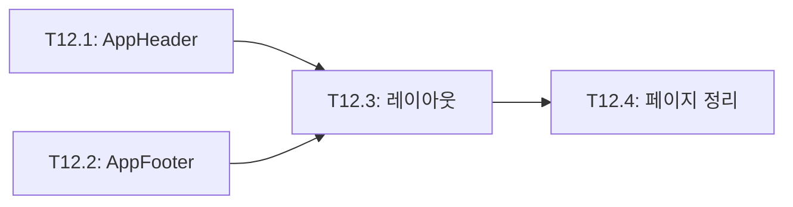
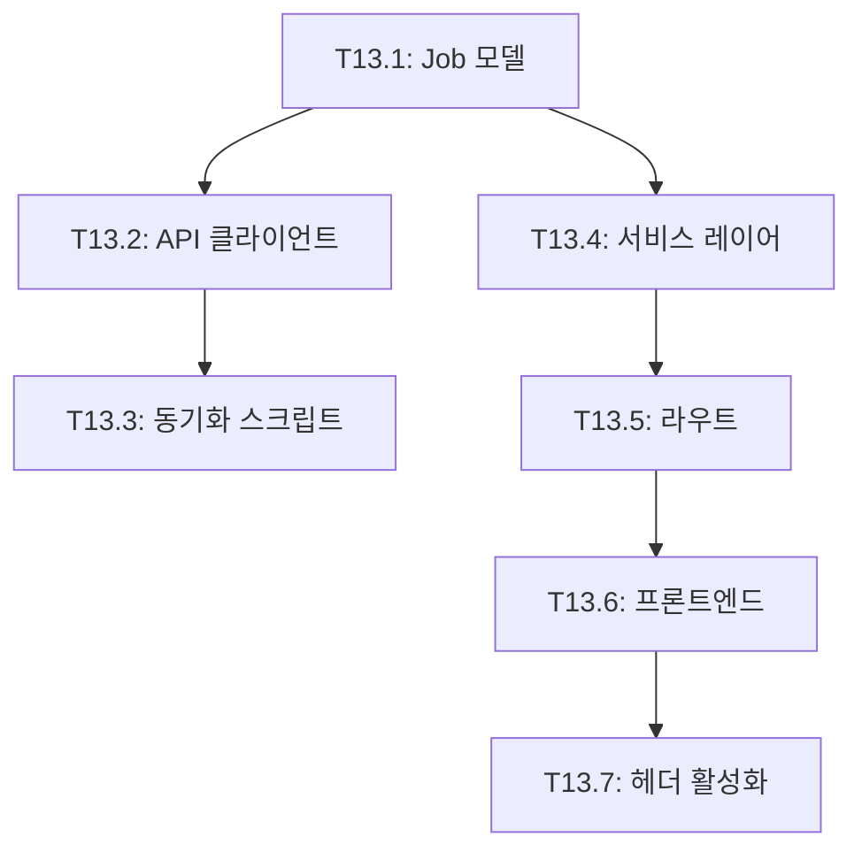
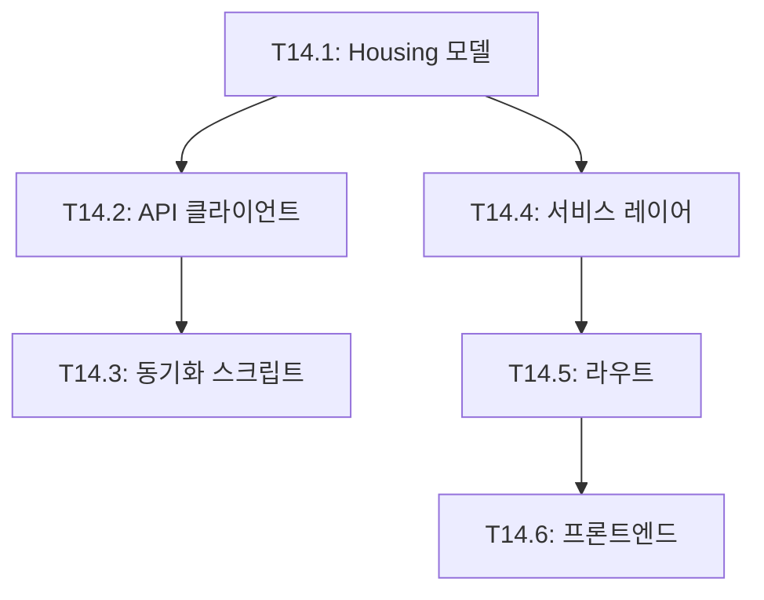
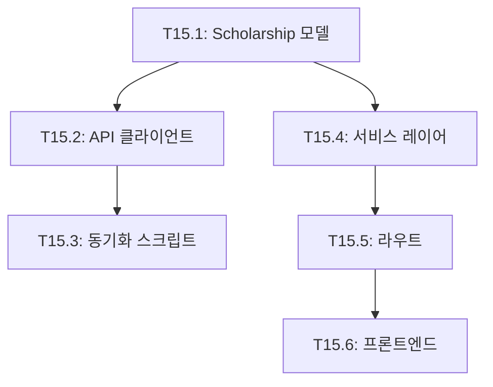
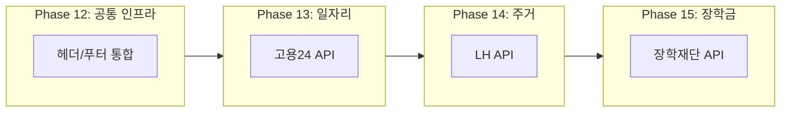

# TASKS: 복지알리미 - 맞춤형 정부 서비스 검색 서비스

> 이 문서는 AI 개발 파트너(오케스트레이터 & 서브에이전트)가 작업을 실행하기 위한 태스크 목록입니다.
> Contract-First TDD 방식을 채택하며, Git Worktree로 병렬 개발을 지원합니다.

---

## 프로젝트 개요

**목표**: 국민 누구나 공공데이터 기반으로 맞춤형 서비스을 쉽게 찾을 수 있는 서비스 제공

**핵심 기능**: 나이/소득/지역 3가지 입력으로 맞춤형 서비스 매칭

**기술 스택**:
- **백엔드**: Express + Prisma + MySQL + Zod
- **프론트엔드**: Vue 3 + Nuxt 3 + TypeScript + TailwindCSS
- **인프라**: Cafe24 서버 + Nginx + PM2 + GitHub Actions + Docker Compose (로컬)

**성공 지표**:
- 노스스타: 월 애드센스 수익 목표 달성
- 입력지표: DAU (일 방문자 수), 검색 전환율 70%+

---

## 마일스톤 개요

| 마일스톤 | 설명 | Phase | 상태 |
|----------|------|-------|------|
| M0 | 프로젝트 셋업 | Phase 0 | ✅ |
| M0.5 | 계약 & 테스트 설계 (Contract-First) | Phase 0 | ✅ |
| M1 | FEAT-0: 랜딩 페이지 | Phase 1 | ✅ |
| M2 | FEAT-1: 서비스 검색 (백엔드) | Phase 2 | ✅ |
| M3 | FEAT-1: 서비스 검색 (프론트엔드) | Phase 3 | ✅ |
| M4 | 보조금24 데이터 동기화 & 통합 테스트 | Phase 4 | ✅ |
| M5 | CI/CD 구축 & 배포 | Phase 5 | ✅ |
| M6 | FEAT-1-3: 서비스 상세 페이지 | Phase 6 | ✅ |
| M7 | 데이터 동기화 복구 | Phase 7 | ✅ |
| M8 | 검색 필터 확장 및 정렬 기능 | Phase 8 | ✅ |
| M9 | 지역 필터링 고도화 | Phase 9 | ✅ |
| M10 | 검색 결과 공유 기능 | Phase 10 | ✅ |
| M11 | 인기 서비스 | Phase 11 | ✅ |
| M12 | 공통 인프라 (헤더/푸터 통합) | Phase 12 | 🔲 |
| M13 | 일자리 검색 (고용24 API) | Phase 13 | 🔲 |
| M14 | 주거/청약 정보 (LH API) | Phase 14 | 🔲 |
| M15 | 장학금 정보 (한국장학재단 API) | Phase 15 | 🔲 |

---

---

> **참고**: 완료된 Phase 0~11의 상세 내용은 [06-tasks-archive.md](./06-tasks-archive.md)를 참조하세요.

## M12: 공통 인프라 (Phase 12)

> 확장 전 필수 인프라 작업: 헤더/푸터를 통합하여 일관된 네비게이션 제공

### [ ] Phase 12, T12.1: AppHeader.vue 생성

**담당**: frontend-specialist

**작업 내용**:
- 기존 페이지들의 헤더를 추출하여 통합 컴포넌트 생성
- 네비게이션 링크: 서비스, 일자리, 주거, 장학금
- 반응형 디자인 (모바일 메뉴)

**산출물**:
| 파일 | 변경 내용 |
|------|----------|
| `components/AppHeader.vue` | 통합 헤더 컴포넌트 생성 |

**완료 조건**:
- [ ] 네비게이션 링크 동작
- [ ] 현재 페이지 활성 상태 표시
- [ ] 모바일 반응형 메뉴
- [ ] 빌드 통과

---

### [ ] Phase 12, T12.2: AppFooter.vue 생성

**담당**: frontend-specialist

**의존성**: 없음 (T12.1과 병렬 가능)

**작업 내용**:
- 기존 페이지들의 푸터를 추출하여 통합 컴포넌트 생성

**산출물**:
| 파일 | 변경 내용 |
|------|----------|
| `components/AppFooter.vue` | 통합 푸터 컴포넌트 생성 |

**완료 조건**:
- [ ] 푸터 정보 표시
- [ ] 빌드 통과

---

### [ ] Phase 12, T12.3: default.vue 레이아웃 생성

**담당**: frontend-specialist

**의존성**: T12.1, T12.2

**작업 내용**:
- Nuxt 레이아웃 시스템 적용
- AppHeader, AppFooter를 레이아웃에 포함

**산출물**:
| 파일 | 변경 내용 |
|------|----------|
| `layouts/default.vue` | 공통 레이아웃 |

**완료 조건**:
- [ ] 레이아웃 적용
- [ ] 빌드 통과

---

### [ ] Phase 12, T12.4: 기존 페이지 헤더/푸터 제거

**담당**: frontend-specialist

**의존성**: T12.3

**작업 내용**:
- index.vue, search.vue, benefits/[id].vue에서 헤더/푸터 제거
- 레이아웃 시스템으로 자동 적용

**수정 파일**:
| 파일 | 변경 내용 |
|------|----------|
| `pages/index.vue` | 헤더/푸터 제거 |
| `pages/search.vue` | 헤더/푸터 제거 |
| `pages/benefits/[id].vue` | 헤더/푸터 제거 |

**완료 조건**:
- [ ] 모든 페이지에서 헤더/푸터 정상 표시
- [ ] 빌드 통과
- [ ] 기능 동작 검증

---

## Phase 12 의존성 그래프



---

## M13: 일자리 검색 (Phase 13)

> 고용24 Open API를 활용한 일자리 검색 기능

### [ ] Phase 13, T13.1: Prisma Job 모델 추가

**담당**: database-specialist

**작업 내용**:
- Job 모델 스키마 작성
- 마이그레이션 실행

**산출물**:
| 파일 | 변경 내용 |
|------|----------|
| `prisma/schema.prisma` | Job 모델 추가 |

**스키마**:
```prisma
model Job {
  id              String   @id @default(cuid())
  externalId      String   @unique @map("external_id")
  companyName     String   @map("company_name")
  title           String
  region          String
  jobType         String   @map("job_type")
  employmentType  String   @map("employment_type")
  education       String?
  experience      String?
  salary          String?
  deadline        DateTime?
  url             String?
  viewCount       Int      @default(0) @map("view_count")
  siteViewCount   Int      @default(0) @map("site_view_count")
  createdAt       DateTime @default(now()) @map("created_at")
  updatedAt       DateTime @updatedAt @map("updated_at")

  @@index([region])
  @@index([jobType])
  @@index([deadline])
  @@map("jobs")
}
```

**완료 조건**:
- [ ] 스키마 작성
- [ ] 마이그레이션 성공
- [ ] Prisma 클라이언트 생성

---

### [ ] Phase 13, T13.2: work24ApiClient.ts 구현

**담당**: backend-specialist

**의존성**: T13.1

**작업 내용**:
- 고용24 Open API 클라이언트 구현
- XML 응답 파싱 (xml2js)
- Rate Limiting 적용

**참고**: 고용24 API는 XML 응답이므로 xml2js 파싱 필요

**산출물**:
| 파일 | 변경 내용 |
|------|----------|
| `services/work24ApiClient.ts` | API 클라이언트 |
| `package.json` | xml2js 의존성 추가 |

**환경변수**:
```bash
WORK24_API_KEY=...
WORK24_BASE_URL=https://openapi.work24.go.kr
```

**완료 조건**:
- [ ] API 호출 성공
- [ ] XML 파싱 성공
- [ ] 타입 정의

---

### [ ] Phase 13, T13.3: syncJobs.ts 동기화 스크립트

**담당**: backend-specialist

**의존성**: T13.2

**작업 내용**:
- 일자리 데이터 동기화 스크립트
- 배치 처리 (100개씩)
- 에러 핸들링

**산출물**:
| 파일 | 변경 내용 |
|------|----------|
| `scripts/syncJobs.ts` | 동기화 스크립트 |
| `package.json` | `sync:jobs` 스크립트 |

**완료 조건**:
- [ ] 동기화 실행 성공
- [ ] DB에 데이터 저장 확인

---

### [ ] Phase 13, T13.4: jobService.ts 서비스 레이어

**담당**: backend-specialist

**의존성**: T13.1

**작업 내용**:
- 일자리 검색 비즈니스 로직
- 필터링 (지역, 직종, 경력, 고용형태)
- 페이지네이션

**산출물**:
| 파일 | 변경 내용 |
|------|----------|
| `services/jobService.ts` | 서비스 레이어 |

**완료 조건**:
- [ ] 검색 로직 구현
- [ ] 필터링 동작
- [ ] 단위 테스트

---

### [ ] Phase 13, T13.5: jobs.ts 라우트 구현

**담당**: backend-specialist

**의존성**: T13.4

**작업 내용**:
- 일자리 API 라우트

**API 엔드포인트**:
| Method | Path | 설명 |
|--------|------|------|
| GET | `/api/jobs` | 일자리 목록 |
| GET | `/api/jobs/:id` | 일자리 상세 |
| GET | `/api/jobs/popular` | 인기 일자리 |
| GET | `/api/jobs/meta/regions` | 지역 목록 |
| GET | `/api/jobs/meta/job-types` | 직종 목록 |

**산출물**:
| 파일 | 변경 내용 |
|------|----------|
| `routes/jobs.ts` | API 라우트 |
| `schemas/job.ts` | Zod 스키마 |
| `index.ts` | 라우트 등록 |

**완료 조건**:
- [ ] API 동작 확인
- [ ] 빌드 통과

---

### [ ] Phase 13, T13.6: 프론트엔드 페이지/컴포넌트

**담당**: frontend-specialist

**의존성**: T13.5

**작업 내용**:
- 일자리 검색 페이지
- 일자리 상세 페이지
- 검색 폼, 카드, 필터 컴포넌트

**산출물**:
| 파일 | 변경 내용 |
|------|----------|
| `pages/jobs/index.vue` | 검색 페이지 |
| `pages/jobs/[id].vue` | 상세 페이지 |
| `components/jobs/JobSearchForm.vue` | 검색 폼 |
| `components/jobs/JobCard.vue` | 결과 카드 |
| `composables/useJobSearch.ts` | 검색 composable |
| `composables/useJobDetail.ts` | 상세 composable |

**완료 조건**:
- [ ] 페이지 렌더링
- [ ] 검색 동작
- [ ] 상세 페이지 동작
- [ ] 빌드 통과

---

### [ ] Phase 13, T13.7: 헤더 네비게이션 "일자리" 활성화

**담당**: frontend-specialist

**의존성**: T13.6, T12.4

**작업 내용**:
- AppHeader에서 일자리 링크 활성화

**산출물**:
| 파일 | 변경 내용 |
|------|----------|
| `components/AppHeader.vue` | 일자리 링크 활성화 |

**완료 조건**:
- [ ] 일자리 메뉴 클릭 동작
- [ ] 빌드 통과

---

## Phase 13 의존성 그래프



---

## M14: 주거/청약 정보 (Phase 14)

> LH 공공임대주택 API를 활용한 주거 정보 검색 기능

### [ ] Phase 14, T14.1: Prisma Housing 모델 추가

**담당**: database-specialist

**산출물**:
| 파일 | 변경 내용 |
|------|----------|
| `prisma/schema.prisma` | Housing 모델 추가 |

**완료 조건**:
- [ ] 스키마 작성
- [ ] 마이그레이션 성공

---

### [ ] Phase 14, T14.2: lhApiClient.ts 구현

**담당**: backend-specialist

**의존성**: T14.1

**산출물**:
| 파일 | 변경 내용 |
|------|----------|
| `services/lhApiClient.ts` | LH API 클라이언트 |

**완료 조건**:
- [ ] API 호출 성공
- [ ] 타입 정의

---

### [ ] Phase 14, T14.3: syncHousing.ts 동기화 스크립트

**담당**: backend-specialist

**의존성**: T14.2

**산출물**:
| 파일 | 변경 내용 |
|------|----------|
| `scripts/syncHousing.ts` | 동기화 스크립트 |
| `package.json` | `sync:housing` 스크립트 |

**완료 조건**:
- [ ] 동기화 실행 성공

---

### [ ] Phase 14, T14.4: housingService.ts 서비스 레이어

**담당**: backend-specialist

**의존성**: T14.1

**산출물**:
| 파일 | 변경 내용 |
|------|----------|
| `services/housingService.ts` | 서비스 레이어 |

**완료 조건**:
- [ ] 검색 로직 구현

---

### [ ] Phase 14, T14.5: housing.ts 라우트 구현

**담당**: backend-specialist

**의존성**: T14.4

**산출물**:
| 파일 | 변경 내용 |
|------|----------|
| `routes/housing.ts` | API 라우트 |
| `schemas/housing.ts` | Zod 스키마 |

**완료 조건**:
- [ ] API 동작 확인

---

### [ ] Phase 14, T14.6: 프론트엔드 /housing 페이지

**담당**: frontend-specialist

**의존성**: T14.5

**산출물**:
| 파일 | 변경 내용 |
|------|----------|
| `pages/housing/index.vue` | 검색 페이지 |
| `pages/housing/[id].vue` | 상세 페이지 |
| `components/housing/HousingCard.vue` | 결과 카드 |
| `composables/useHousingSearch.ts` | 검색 composable |

**완료 조건**:
- [ ] 페이지 렌더링
- [ ] 빌드 통과

---

## Phase 14 의존성 그래프



---

## M15: 장학금 정보 (Phase 15)

> 한국장학재단 API를 활용한 장학금 정보 검색 기능

### [ ] Phase 15, T15.1: Prisma Scholarship 모델 추가

**담당**: database-specialist

**산출물**:
| 파일 | 변경 내용 |
|------|----------|
| `prisma/schema.prisma` | Scholarship 모델 추가 |

**완료 조건**:
- [ ] 스키마 작성
- [ ] 마이그레이션 성공

---

### [ ] Phase 15, T15.2: kosafApiClient.ts 구현

**담당**: backend-specialist

**의존성**: T15.1

**산출물**:
| 파일 | 변경 내용 |
|------|----------|
| `services/kosafApiClient.ts` | 장학재단 API 클라이언트 |

**완료 조건**:
- [ ] API 호출 성공

---

### [ ] Phase 15, T15.3: syncScholarships.ts 동기화 스크립트

**담당**: backend-specialist

**의존성**: T15.2

**산출물**:
| 파일 | 변경 내용 |
|------|----------|
| `scripts/syncScholarships.ts` | 동기화 스크립트 |
| `package.json` | `sync:scholarship` 스크립트 |

**완료 조건**:
- [ ] 동기화 실행 성공

---

### [ ] Phase 15, T15.4: scholarshipService.ts 서비스 레이어

**담당**: backend-specialist

**의존성**: T15.1

**산출물**:
| 파일 | 변경 내용 |
|------|----------|
| `services/scholarshipService.ts` | 서비스 레이어 |

**완료 조건**:
- [ ] 검색 로직 구현

---

### [ ] Phase 15, T15.5: scholarship.ts 라우트 구현

**담당**: backend-specialist

**의존성**: T15.4

**산출물**:
| 파일 | 변경 내용 |
|------|----------|
| `routes/scholarship.ts` | API 라우트 |
| `schemas/scholarship.ts` | Zod 스키마 |

**완료 조건**:
- [ ] API 동작 확인

---

### [ ] Phase 15, T15.6: 프론트엔드 /scholarship 페이지

**담당**: frontend-specialist

**의존성**: T15.5

**산출물**:
| 파일 | 변경 내용 |
|------|----------|
| `pages/scholarship/index.vue` | 검색 페이지 |
| `pages/scholarship/[id].vue` | 상세 페이지 |
| `components/scholarship/ScholarshipCard.vue` | 결과 카드 |
| `composables/useScholarshipSearch.ts` | 검색 composable |

**완료 조건**:
- [ ] 페이지 렌더링
- [ ] 빌드 통과

---

## Phase 15 의존성 그래프



---

## 전체 확장 로드맵 (Phase 12~15)



**구현 순서**: Phase 12 → Phase 13 → Phase 14 → Phase 15
