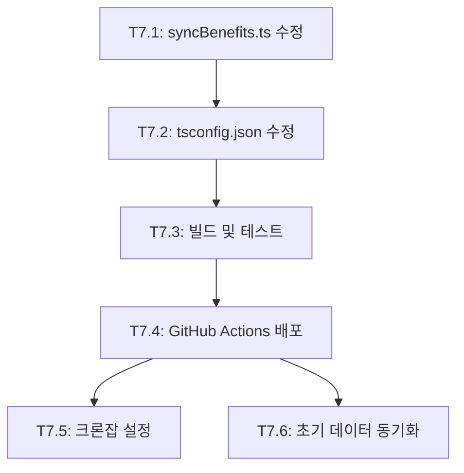

# Phase 7: 데이터 동기화 수정 계획

> **목표**: 보조금24 데이터 일일 동기화 기능 복구
> **예상 소요**: 1-2시간

---

## 현재 문제점

### 1. Import 경로 오류
```typescript
// syncBenefits.ts (현재 - 잘못됨)
import { fetchGov24ServiceList, fetchGov24SupportConditions } from './publicApiClient.js';

// 올바른 경로
import { fetchAllServiceList, fetchAllSupportConditions } from './gov24ApiClient.js';
```

### 2. 함수명 불일치
| syncBenefits.ts에서 호출 | gov24ApiClient.ts 실제 함수명 |
|------------------------|------------------------------|
| `fetchGov24ServiceList` | `fetchAllServiceList` |
| `fetchGov24SupportConditions` | `fetchAllSupportConditions` |

### 3. 빌드 제외
```json
// backend/tsconfig.json
"exclude": ["node_modules", "dist", "__tests__", "src/services/syncBenefits.ts"]
```
→ syncBenefits.ts가 빌드에서 제외되어 dist/에 없음

### 4. 크론잡 미설정
서버에 일일 동기화 크론잡이 설정되지 않음

---

## 수정 작업

### T7.1: syncBenefits.ts 수정
**파일**: `backend/src/services/syncBenefits.ts`

**변경 내용**:
1. import 경로 수정: `publicApiClient.js` → `gov24ApiClient.js`
2. 함수명 수정: `fetchGov24ServiceList` → `fetchAllServiceList`
3. 함수명 수정: `fetchGov24SupportConditions` → `fetchAllSupportConditions`
4. DB 필드 매핑 업데이트 (gov24ApiClient 타입에 맞게)

### T7.2: tsconfig.json 수정
**파일**: `backend/tsconfig.json`

**변경 내용**:
- exclude 목록에서 `src/services/syncBenefits.ts` 제거

### T7.3: 빌드 및 테스트
```bash
cd backend
npm run build
npm run sync:benefits  # 로컬 테스트
```

### T7.4: GitHub Actions 배포
- syncBenefits.ts가 dist/에 포함되어 배포됨

### T7.5: 서버 크론잡 설정
**서버 작업**:
```bash
# 크론잡 설정 (매일 새벽 3시)
crontab -e
0 3 * * * cd /home/project1/alimi/backend && node dist/services/syncBenefits.js >> /var/log/alimi-sync.log 2>&1
```

### T7.6: 초기 데이터 동기화 실행
```bash
# 서버에서 수동 실행
cd /home/project1/alimi/backend
node dist/services/syncBenefits.js
```

---

## 검증 체크리스트

- [ ] `npm run build` 성공 (syncBenefits.js가 dist/에 생성됨)
- [ ] 로컬에서 `npm run sync:benefits` 성공
- [ ] GitHub Actions 배포 성공
- [ ] 서버에서 `node dist/services/syncBenefits.js` 성공
- [ ] DB에 데이터 확인: `SELECT COUNT(*) FROM benefits;`
- [ ] 검색 API 정상 동작
- [ ] 크론잡 설정 완료

---

## 의존성 그래프



---

## 예상 결과

- **데이터**: ~10,924개 복지 서비스 동기화
- **소요 시간**: 초기 동기화 약 15-30분 (API 호출 제한으로 인한 대기)
- **일일 갱신**: 매일 새벽 3시 자동 동기화
